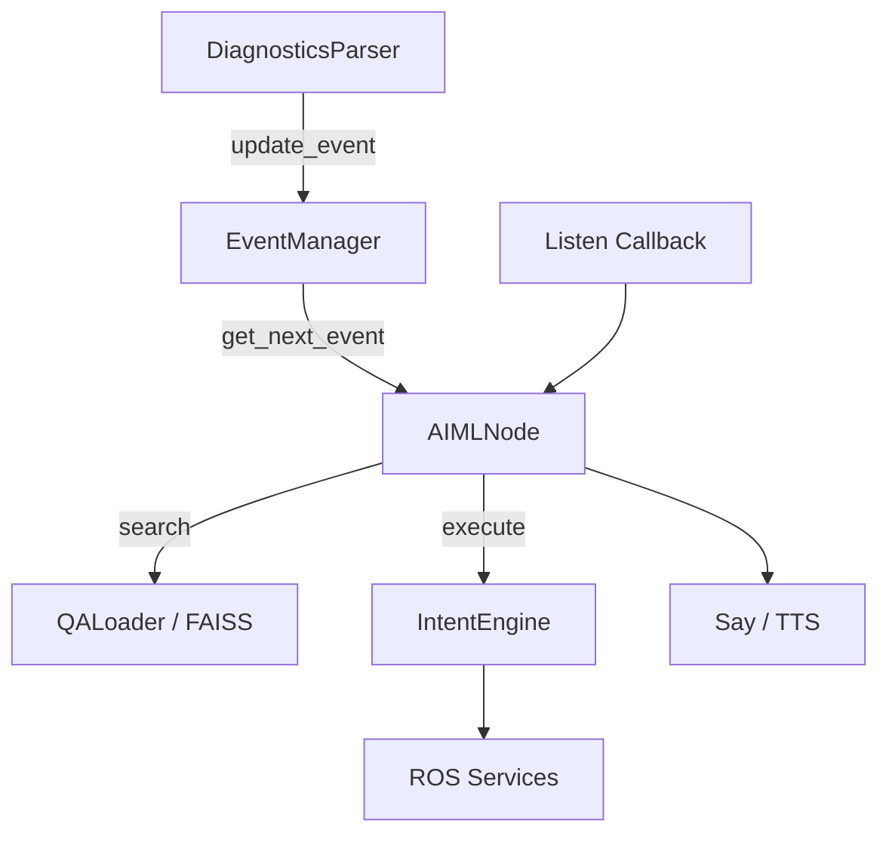

# Qbo AIML – Architecture & Event System

## 🎯 Objectif

Mettre en place un système conversationnel intelligent capable de :

- Interpréter les diagnostics ROS
- Détecter des événements pertinents
- Générer une réponse contextuelle (RAG)
- Proposer une action corrective
- Attendre confirmation
- Exécuter l’action
- Résoudre l’événement

---

# 🧠 Architecture Générale

## 1️⃣ DiagnosticsParser

Rôle :
- Écoute `/diagnostics`
- Met à jour `robot_state`
- Détecte changements de niveau
- Applique filtre de stabilité temporelle
- Appelle `EventManager.update_event()`

Ne fait PAS :
- De TTS
- De logique métier
- De RAG

---

## 2️⃣ EventManager

Rôle :
- Gérer cycle de vie des événements
- Anti-spam (cooldown)
- Priorité (error > warning > info)
- Snooze
- Queue d’événements

Ne fait PAS :
- De ROS
- De parole
- De logique RAG

### États d’un événement

| État | Description |
|------|------------|
| inactive | Aucun problème |
| active | Problème détecté |
| snoozed | Problème temporairement ignoré |
| proposed | Action proposée à l’utilisateur |
| resolved | Problème résolu |

---

## 3️⃣ AIMLNode

Rôle central :

- Lance `process_events()` périodiquement
- Interroge `EventManager.get_next_event()`
- Lance RAG sur message diagnostic
- Génère phrase via `generate_answer()`
- Propose action si intent présent# Qbo AIML – Architecture & Event System

## 🎯 Objectif

Mettre en place un système conversationnel intelligent capable de :

- Interpréter les diagnostics ROS
- Détecter des événements pertinents
- Générer une réponse contextuelle (RAG)
- Proposer une action corrective
- Attendre confirmation
- Exécuter l’action
- Résoudre l’événement

---

# 🧠 Architecture Générale

## 1️⃣ DiagnosticsParser

Rôle :
- Écoute `/diagnostics`
- Met à jour `robot_state`
- Détecte changements de niveau
- Applique filtre de stabilité temporelle
- Appelle `EventManager.update_event()`

Ne fait PAS :
- De TTS
- De logique métier
- De RAG

---

## 2️⃣ EventManager

Rôle :
- Gérer cycle de vie des événements
- Anti-spam (cooldown)
- Priorité (error > warning > info)
- Snooze
- Queue d’événements

Ne fait PAS :
- De ROS
- De parole
- De logique RAG

### États d’un événement

| État | Description |
|------|------------|
| inactive | Aucun problème |
| active | Problème détecté |
| snoozed | Problème temporairement ignoré |
| proposed | Action proposée à l’utilisateur |
| resolved | Problème résolu |

---

## 3️⃣ AIMLNode

Rôle central :

- Lance `process_events()` périodiquement
- Interroge `EventManager.get_next_event()`
- Lance RAG sur message diagnostic
- Génère phrase via `generate_answer()`
- Propose action si intent présent
- Gère confirmation utilisateur

---

## 4️⃣ QALoader (RAG)

Rôle :
- Charger index FAISS
- Recherche sémantique
- Retourne `(best_item, confidence)`

Deux seuils :
- Dialogue utilisateur : seuil modéré
- Diagnostic event : seuil strict

---

## 5️⃣ IntentEngine

Rôle :
- Mapper action → handler
- Appeler services ROS
- Publier topics
- Retourner statut d’exécution

Ne gère PAS :
- Confirmation
- Dialogue
- Event lifecycle

---

# 🔄 Cycle Complet d’un Événement

- Gère confirmation utilisateur

---

## 4️⃣ QALoader (RAG)

Rôle :
- Charger index FAISS
- Recherche sémantique
- Retourne `(best_item, confidence)`

Deux seuils :
- Dialogue utilisateur : seuil modéré
- Diagnostic event : seuil strict

---

## 5️⃣ IntentEngine

Rôle :
- Mapper action → handler
- Appeler services ROS
- Publier topics
- Retourner statut d’exécution

Ne gère PAS :
- Confirmation
- Dialogue
- Event lifecycle

---

# 🔄 Cycle Complet d’un Événement

- Diagnostic change
↓
- Stabilité temporelle OK
↓
- EventManager.update_event(active=True)
↓
- process_events()
↓
- RAG(message)
↓
- say("Problème détecté...")
↓
- pending_confirmation = { intent, key }
↓
- Utilisateur répond "oui"
↓
- IntentEngine.execute()
↓
- Service ROS lancé
↓
- Diagnostic change → level=0
↓
- EventManager.resolve_event()

# ⚙️ Filtrage de stabilité

Un changement de niveau doit rester stable pendant X secondes avant activation.

But :
- Ignorer glitch série
- Ignorer micro coupures
- Stabiliser robot

---

# 🛡️ Protection contre répétitions

- `cooldown_default`
- `snooze_event(key)`
- seuil RAG minimal pour event

---

# 🧩 Maintenance Mode (optionnel futur)

Lors d’une action longue :

- Suspendre certains diagnostics
- Ignorer erreurs transitoires
- Désactiver certaines alertes

---

# 🚀 Évolutions Futures

- Historique des événements
- Mémoire long terme
- Auto-réparation automatique si stable
- Regroupement multi-erreurs
- Mode "maintenance"

---

# 📌 Philosophie

Séparation stricte :

DiagnosticsParser → Observe
EventManager → Décide
AIMLNode → Parle
IntentEngine → Agit
RAG → Comprend

## 🏗 Architecture des modules




---

## 🧠 Ce que ça montre

Ce diagramme répond à :

> Que devient un événement dans le temps ?

On voit les transitions :

- Détection
- Proposition
- Attente confirmation
- Exécution
- Résolution

C’est une **machine à états finis (FSM)**.

---

# 🎯 Différence fondamentale

| Architecture | Diagramme d’état |
|-------------|------------------|
| Structure | Comportement |
| Modules | Cycle de vie |
| Qui appelle qui | Comment ça évolue |
| Vue globale système | Vue interne d’un event |

---

# 🧠 Pourquoi les deux sont importants

Sans architecture → tu mélanges les responsabilités
Sans machine d’état → tu crées des bugs de logique

Toi là, tu es exactement au bon moment pour structurer ça.

---

# 🚀 Option avancée (industriel)

On pourrait aller encore plus loin :

Ajouter un vrai état interne dans `EventManager` :

```python
{
    "key": "...",
    "state": "active" | "proposed" | "executing" | "resolved",
    "severity": "...",
    "message": "...",
    "last_change": timestamp
}